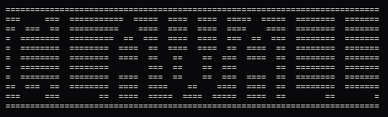

# ClawAll


AI safety firewall and governance runtime for autonomous OpenClaw agents on Sui.

## 📄 Documentation
Official Documentation: [clawall.netlify.app/docs.html](https://clawall.netlify.app/docs.html)

---

## Why this project

ClawAll gives an agent powerful local execution while enforcing hard controls that fail closed:

- **Pre-execution intent firewall** for OS/browser/blockchain actions.
- **Risk scoring + policy decisions** + human approval for risky transfers.
- **Policy integrity signature** and on-chain hash anchor verification (STRICT mode).
- **Multi-coin support** for all assets in the vault (SUI, USDC, WAL, etc.) with verified decimals.
- **Human-friendly agent responses** using conversational synthesis.
- **Runtime cap-isolation** checks to prevent policy-admin capability leakage.
- **On-chain Move constraints** (`max_amount`, recipient binding, expiry).
- **Walrus audit proof logging** (transaction proposal + OS quilt mirror).

## Security pipeline

```text
Agent Intent
  -> Intent Firewall
  -> Risk Engine
  -> Policy Engine
  -> Telegram Governance
  -> Policy Integrity + Anchor Checks (Strict Sync)
  -> Move Constraint Execution
  -> Walrus Audit / OS Quilt
```

Any layer can block execution.

## Repository map

- Runtime orchestrator: `src/orchestrator/intent-orchestrator.mjs`
- Chain execution gateway: `src/chain/sui-transaction-gateway.mjs`
- Move module: `chain/sui/sources/enforcer.move`
- Governance bot: `src/governance/telegram-bot.mjs`
- Policy integrity + anchor tools: `src/enforcement/`
- OpenClaw Plugin: `src/plugins/clawall-openclaw-plugin/`

## Quickstart (single machine demo)

1. Install dependencies.

```bash
npm install
```

2. Configure `.env` (minimum values).

```env
PACKAGE_ID=<sui_package_id>
RPC_URL=https://fullnode.testnet.sui.io:443
PRIVATE_KEY=<runtime_or_demo_private_key>
GUARD_CAP_ID=<guard_cap_object_id>
FREEZE_STATE_ID=<global_freeze_object_id>

TG_BOT_TOKEN=<telegram_bot_token>
TG_CHAT_ID=<telegram_chat_id>
TG_OPERATOR_USERNAMES=@your_username

# Security Modes
POLICY_INTEGRITY_MODE=strict
POLICY_ANCHOR_MODE=strict
```

3. Run secure bootstrap (signs code + syncs environment).

```bash
npm run setup
```

4. Start gateway.

```bash
npm run gateway
```

## Operator command reference

### Core scripts

- `npm run demo` -> interactive shell demo.
- `npm test` -> automated security tests.
- `npm run policy:sign` -> updates policy signature bundle.
- `npm run policy:anchor` -> syncs local signature to on-chain anchor.
- `npm run admin` -> interactive vault and capability manager.
- `npm run forensics:bundle` -> generate incident forensics package.

### Demo shell menu

```text
1  -> Normal Transaction (Low Risk)
2  -> Medium Risk Transaction (Approval Required)
3  -> High Risk Transaction (Approval Required)
4  -> Simulate OS Attack (Kill Switch)
9  -> Simulate Policy Tamper (Integrity Block)
```

## OpenClaw Integration

ClawAll includes a production-ready OpenClaw plugin:

```bash
openclaw plugins install ./src/plugins/clawall-openclaw-plugin
```

Plugin features:
- **Natural Language Parsing:** "send 0.01 sui to 0x..." works out of the box.
- **Human-in-the-loop:** Prompts for approval via Telegram for high-risk actions.
- **Conversational Responses:** The agent responds naturally with transaction details and explorer links.
- **Multi-token Awareness:** Automatically handles decimals and pricing for vault assets.

## Production-style split custody (Security Mandate)

Use two wallets/sessions:
- **Runtime Agent:** Owns `GuardCap` and `GlobalFreeze` access only.
- **Policy Admin:** Owns `PolicyAdminCap` (Master key).

This ensures the agent cannot rewrite its own security policy even if the runtime host is compromised.

## Current limitations

- Telegram is a centralized approval transport.
- Audit availability depends on Walrus/RPC health; execution blocks when audit write fails.

These are explicit design tradeoffs for security-first fail-closed behavior.
